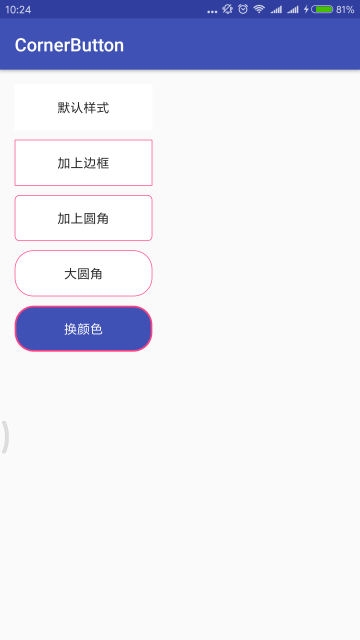

# CornerButton

### 效果




### Gradle
``` groovy
allprojects {
	repositories {
    	...
		maven { url 'https://jitpack.io' }
	}
}
dependencies {
	compile 'com.github.WisonZhang:CornerButton:V1.0'
}
```

### 可选属性
<table>
  <tdead>
    <tr>
      	<th align="center">属性/Attribute</th>
      	<th align="center">介绍/introduce</th>
    </tr>
  </tdead>
  <tbody>
   	<tr>
      	<td align="center">corner</td>
      	<td align="center">圆角大小</td>
    </tr>
    <tr>
     <td align="center">normal_color</td>
      	<td align="center">正常展示颜色，默认白色</td>
    </tr>
    <tr>
      <td align="center">pressed_color</td>
      	<td align="center">按下颜色（不设置在正常颜色上变灰）</td>
    </tr>
    <tr>
      <td align="center">stroke_width</td>
      	  <td align="center">边框大小，默认为0</td>
    </tr>
    <tr>
     	 <td align="center">stroke_color</td>
      	  <td align="center">边框颜色，需设置边框大小</td>
    </tr>
  </tbody>
</table>

### 可用方法

setNormalColor </br>
setPressedColor </br>
setStrokeColor </br>
setStrokeWidth </br>
setCorner

### 更新日志 Update Logs

#### v1.0.0
- 增加圆角、边框设置